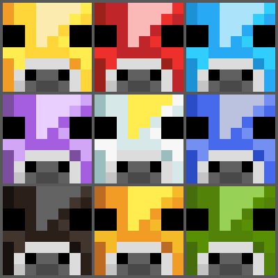

# Mooblooms

Mooblooms is a mod inspired by Minecraft Earth game, adding colorful and flowery cows.
Made using Fabric API.

[](https://www.curseforge.com/minecraft/mc-mods/mooblooms)
[](https://www.curseforge.com/minecraft/mc-mods/mooblooms)
[](https://www.curseforge.com/minecraft/mc-mods/mooblooms)
[](LICENSE)
---

## Downloads

- [Modrinth](https://modrinth.com/mod/mooblooms)
- [CurseForge](https://www.curseforge.com/minecraft/mc-mods/mooblooms)

## Configuration
Mooblooms features can be configured in two different locations.

### JSON config
Under your `config` folder, you will find a `mooblooms.json` file.
For each moobloom or cluckshroom, it allows you to configure their spawning and behavior.

This config can also be accessed through the mod menu in-game.

### Datapack
The spawning biomes of each moobloom or cluckshroom can be customized with biome tags.
An example path is `data/mooblooms/tags/worldgen/biome/spawns_cherry_moobloom`.

## API
Since 1.3.0, Mooblooms provides builders to easily add mooblooms and cluckshrooms to your mod.

#### Adding Mooblooms to your project
You can use Mooblooms as a library for your gradle project. Add the following in your ``build.gradle``:
```gradle
repositories {
    maven { url 'https://jitpack.io' }
}

dependencies {
    modCompile "com.github.YanisBft:Mooblooms:${mooblooms_version}"
}
```
Then, add the version in your ``gradle.properties``:
```properties
mooblooms_version = 1.6.4
```

#### Available settings
* ``name(Identifier name)`` (**required**)
* ``blockState(BlockState state)`` (**required**)
* ``blockState(Block block)``
* ``blockStateRenderer(float scaleX, float scaleY, float scaleZ, double translationX, double translationY, double translationZ)``
* ``blockStateRenderer(Vector3f scale, Vec3d translation)``
* ``fireImmune()``
* ``validBlocks(List<Block> blocks)``
* ``cannotPlaceBlocks()``
* ``ignoredEffects(List<StatusEffect> effects)``
* ``ignoredDamageTypes(List<RegistryKey<DamageType>> damageTypes)``
* ``particle(ParticleEffect particle)``
* ``lootTable(Identifier lootTable)``
* ``spawnEntry(SpawnEntry spawnEntry)``
* ``spawnGroup(SpawnGroup spawnGroup)``
* ``spawnPredicate(SpawnRestriction.SpawnPredicate spawnPredicate)``
* ``spawnEgg(int primaryColor, int secondaryColor)``
* ``spawnEgg(int primaryColor, int secondaryColor, RegistryKey<ItemGroup> group)``
* ``configCategory(MoobloomConfigCategory configCategory)``

#### What you need to do
You still need to do additional things outside the builders:
* Make the texture file of your entity
* Create the model file of your spawn egg
* Add a config for your entity if you wish
